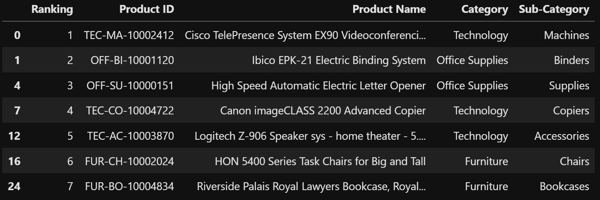

# Sistema de Recomendações (Sam's Club - Walmart)

**Sistema de recomendações de produtos para consumidores do Sam's Club - Walmart, utilizando Deep Learning para personalização e otimização da experiência de compra.**

## Sumário
- [Descrição do Projeto](#descrição-do-projeto)
- [Motivação](#motivação)
- [Tecnologias Utilizadas](#tecnologias-utilizadas)
- [Estrutura do Projeto](#estrutura-do-projeto)
- [Base de Dados](#base-de-dados)
- [Processo de Desenvolvimento](#processo-de-desenvolvimento)
- [Instalação e Uso](#instalação-e-uso)
- [Resultados e Recomendações](#resultados-e-recomendações)
- [Observações Importantes](#observações-importantes)
- [Licença](#licença)
- [Contato](#contato)

## Descrição do Projeto:

Este projeto implementa um sistema de recomendação de produtos baseado em técnicas de Deep Learning. Utilizando a biblioteca TensorFlow (com a API Keras), o modelo é treinado em uma base de dados de transações do Sam's Club - Walmart para identificar padrões de compra. O objetivo final é gerar uma lista personalizada dos 07 (sete) melhores produtos recomendados para consumidores, otimizando a experiência de compra e as estratégias de vendas.

No exemplo demonstrado, as recomendações são geradas para o cliente 'Darrin Van Huff'. No entanto, o sistema foi desenvolvido com uma função flexível que permite a geração de recomendações para *qualquer* consumidor, incluindo novos clientes que não estavam na base de dados original de treinamento.

## Motivação:

O principal objetivo deste projeto é aprimorar a experiência de compra dos clientes do Sam's Club - Walmart. Ao oferecer recomendações de produtos altamente personalizadas, buscamos aumentar a satisfação do cliente, fomentar a lealdade e, consequentemente, otimizar as vendas e o engajamento com a plataforma, direcionando os usuários para produtos que realmente lhes interessam.

## Tecnologias Utilizadas:

* **Python:** Linguagem de programação principal.
* **Pandas:** Para manipulação e análise de dados.
* **Numpy:** Para operações numéricas otimizadas.
* **TensorFlow (Keras):** Framework de Deep Learning para construção e treinamento do modelo de recomendação.
* **SHAP:** Para interpretação da importância das características no modelo (exploratório no `04_777_Metodo_SHAP.ipynb`).
* **Matplotlib / Seaborn:** Para visualização de dados (se aplicável nos notebooks).

## Estrutura do Projeto:

Este repositório está organizado da seguinte forma:

* `dados/`: Contém os dados brutos e o arquivo `data.parquet` utilizados para a análise e treinamento do modelo.
    * `dados_brutos_sams_club.csv`: A base de dados bruta.
    * `dados_tratados.parquet`: Versão tratada e otimizada da base de dados, salva no formato Parquet para melhor performance.
* `models/`: (Diretório para modelos salvos, se aplicável, como `best_model_recomendacao.keras`)
* `notebooks/`: Contém os notebooks Jupyter que documentam o processo de desenvolvimento.
    * `01_777_Sistema_Recomendacao_Inicial.ipynb`: Análise exploratória inicial, pré-processamento de dados e correções.
    * `02_777_Sistema_Recomendacao_Final.ipynb`: Implementação do modelo de recomendação, treinamento e geração das primeiras recomendações.
    * `03_777_Sistema_Recomendacao_Producao.ipynb`: Adaptação do modelo para um ambiente de produção e salvamento do modelo treinado.
    * `04_777_Metodo_SHAP.ipynb`: Exploração do método SHAP para interpretar as previsões do modelo.
* `img/`: (Se houver imagens no README, como a do screenshot da saída do modelo)
    * `Screenshot_saida_modelo.png`: Captura de tela da saída de exemplo do modelo.
* `README.md`: Este arquivo.
* `LICENSE.md`: Arquivo contendo a licença do projeto (MIT).
* `requirements.txt`: Lista de todas as dependências Python necessárias para o projeto.

## Base de Dados:

A análise e o modelo de recomendação utilizam uma base de dados de vendas, que inicialmente foi explorada e corrigida no notebook `01_777_Sistema_Recomendacao_Inicial.ipynb`. As principais correções incluíram:
-   Eliminação de valores nulos.
-   Correção de tipos de dados (`dtypes`).
-   Realização de *downcast* dos dados para otimização de memória.
A base tratada é então salva no formato Parquet (`superstore_data_tratada.parquet`) para carregamento mais eficiente nos notebooks subsequentes.

## Processo de Desenvolvimento:

O desenvolvimento do sistema de recomendação seguiu as seguintes etapas principais, documentadas nos notebooks:

1.  **Análise Exploratória e Pré-processamento (`01_777_Sistema_Recomendacao_Inicial.ipynb`):**
    * Carga e inspeção inicial da base de dados.
    * Tratamento de dados (nulos, tipos, downcast).
    * Salvamento da base tratada em formato Parquet.

2.  **Construção e Treinamento do Modelo (`02_777_Sistema_Recomendacao_Final.ipynb`):**
    * Filtragem de colunas relevantes para o modelo.
    * Codificação de clientes e produtos (transformando nomes/IDs em representações numéricas).
    * Normalização dos dados de vendas (utilizando `MinMaxScaler`).
    * Criação de um conjunto de dados TensorFlow (`tf.data.Dataset`).
    * Definição das dimensões dos *embeddings* (para clientes, produtos, categorias e subcategorias).
    * Criação da arquitetura do modelo de Deep Learning com camadas de *embedding* e camadas densas.
    * Treinamento do modelo.
    * Implementação da função `recomendar_produtos` para gerar recomendações personalizadas.

3.  **Preparação para Produção (`03_777_Sistema_Recomendacao_Producao.ipynb`):**
    * Ajustes e considerações para a escalabilidade e uso do modelo em um ambiente real.
    * Implementação de uma função para salvar o modelo treinado de forma robusta.

4.  **Interpretabilidade do Modelo (`04_777_Metodo_SHAP.ipynb`):**
    * Aplicação do método SHAP (SHapley Additive exPlanations) para entender a contribuição de cada característica nas previsões do modelo, fornecendo insights sobre por que certas recomendações são feitas.

## Instalação e Uso:

Para configurar e executar este projeto em seu ambiente local, siga as instruções abaixo:

1.  **Pré-requisitos:**
    * Python 3.8+
    * `pip` (gerenciador de pacotes do Python)
    * Jupyter Lab ou Jupyter Notebook

2.  **Clone o repositório:**
    ```bash
    git clone [https://github.com/seu-usuario/Projeto_7_Sistema_de_Recomendacao.git](https://github.com/seu-usuario/Projeto_7_Sistema_de_Recomendacao.git)
    cd Projeto_7_Sistema_de_Recomendacao
    ```
    *(Lembre-se de substituir `seu-usuario` pelo seu nome de usuário do GitHub.)*

3.  **Crie o arquivo `requirements.txt`:**
    * Certifique-se de que está na raiz do projeto.
    * **No PowerShell (Windows):**
        ```powershell
        pip freeze | Out-File -FilePath requirements.txt -Encoding UTF8
        ```
    * **No Linux/macOS (ou Git Bash no Windows):**
        ```bash
        pip freeze > requirements.txt
        ```
    *(**Importante:** Faça isso *depois* de ter todas as bibliotecas usadas nos notebooks instaladas no seu ambiente Python.)*

4.  **Instale as dependências:**
    * Com o `requirements.txt` criado, instale todas as bibliotecas necessárias:
        ```bash
        pip install -r requirements.txt
        ```

5.  **Execute o Projeto:**
    * Inicie o Jupyter Lab na raiz do projeto:
        ```bash
        jupyter lab
        ```
    * Navegue até a pasta `notebooks/` e execute os notebooks sequencialmente (`01_777_Sistema_Recomendacao_Inicial.ipynb`, `02_777_Sistema_Recomendacao_Final.ipynb`, etc.) para entender o fluxo completo da análise e do desenvolvimento do modelo.

## Resultados e Recomendações:

O sistema de recomendação gera uma lista dos 07 (sete) produtos mais relevantes para um determinado cliente. No exemplo do notebook `02_777_Sistema_Recomendacao_Final.ipynb`, as recomendações são para o cliente 'Darrin Van Huff'. Uma captura de tela do DataFrame de recomendações gerado pode ser vista abaixo:



## Observações Importantes:

A função `recomendar_produtos`, desenvolvida e presente no notebook final, é projetada para ser flexível. Ela permite que **novos clientes** (aqueles que não estavam presentes na base de dados original de treinamento) também recebam recomendações dos 07 (sete) melhores produtos. Esta capacidade é crucial para a escalabilidade e aplicabilidade prática do sistema em cenários de novos usuários ou expansão da base de clientes.

## Licença:

Este projeto está licenciado sob a Licença MIT. Para mais detalhes, consulte o arquivo [LICENSE.md](LICENSE.md) na raiz do repositório.

## Contato:

Se tiver alguma dúvida, sugestão ou quiser colaborar, sinta-se à vontade para entrar em contato:
-   **Nome:** Flávio Henrique Barbosa
-   **LinkedIn:** [Flávio Henrique Barbosa | LinkedIn](https://www.linkedin.com/in/fl%C3%A1vio-henrique-barbosa-38465938)
-   **Email:** flaviohenriquehb777@outlook.com